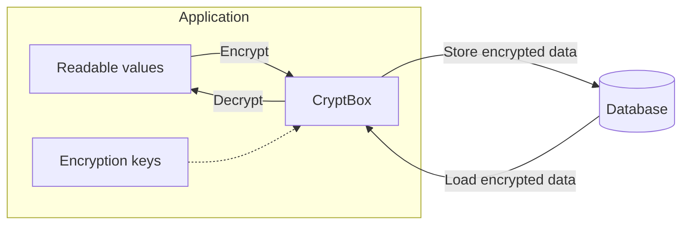

# CryptBox

[](https://github.com/sagikazarmark/cryptbox/actions/workflows/ci.yaml)
[](https://securityscorecards.dev/viewer/?uri=github.com/sagikazarmark/cryptbox)
[](https://crates.io/crates/cryptbox)
[](https://docs.rs/cryptbox/0.5.0/cryptbox/)

**Type-safe encryption for sensitive data in Rust.**

CryptBox encrypts sensitive data before you store it in a database.



> [!WARNING]
> CryptBox is early in development and **not yet production-ready**.
>
> Read the [threat model](docs/security.md) for its security boundaries and
> outstanding review work.

It can protect encrypted fields in a stolen database dump when keys stay
separate. It does not protect a compromised application, prevent replay or
same-field cross-row substitution, or hide query patterns. Blind indexes leak
equality/frequency; every hit requires decrypted, normalized comparison.

[Get started](docs/first-field.md) · [Documentation](docs/README.md) ·
[Threat model](docs/security.md) · [API](https://docs.rs/cryptbox/0.5.0/cryptbox/)

Repository docs describe development; select your dependency version on docs.rs.
Stored-byte Serde support is unreleased.

## Features

- Typed profiles select codecs, padding, stable field binding, and key providers.
- Generation-tagged ciphertext supports key rotation without immediate rewrites.
- Separately keyed blind indexes support equality **candidate** lookup.
- Prepared storage derives ciphertext and indexes from one value for atomic writes.
- Optional Serde stored bytes (unreleased), SQLx PostgreSQL/SQLite adapters, and bounded migration support.
- CryptBox-owned keys/plaintext buffers are zeroized and debug output is redacted.

## Quick Start

This in-memory demonstration uses no optional features (`cryptbox = "=0.5.0"`).
Keys are ephemeral: do not use this provisioning pattern for durable data.
For the complete manifest, file placement, and expected output, follow
[encrypt your first field](docs/first-field.md).

<!-- BEGIN SHARED: first-field -->

```rust
use cryptbox::{Encrypted, EncryptionKey, LocalEncryptionKeyring};

cryptbox::profile! {
    UserEmail: String {
        id: "ca274e85-63c4-4f7d-a255-2dfecbfe5e25",
        name: "user-email",
        codec: cryptbox::Utf8,
        binding: field_bound,
    }
}

fn main() -> Result<(), cryptbox::Error> {
    // Ephemeral demo keys: a new key and generation ID on every run.
    let keys = LocalEncryptionKeyring::new(EncryptionKey::generate()?, [])?;
    let email = Encrypted::<_, UserEmail>::new("mark@example.com".to_owned());
    let ciphertext = email.encrypt_with(&(), &keys)?;
    let decrypted = ciphertext.decrypt_with(&(), &keys)?;
    assert_eq!(decrypted.expose_secret(), "mark@example.com");
    assert_eq!(email.expose_secret(), "mark@example.com"); // Source retained.
    println!("Field-bound round trip succeeded.");
    Ok(())
}
```

<!-- END SHARED: first-field -->

The macro selects UTF-8 encoding, field binding, no padding, and the default key
context. `Encrypted` holds plaintext; `Ciphertext` holds the encrypted envelope.
`&()` is the unit **binding context**, not a key provider or an opt-out from
field binding. `&keys` supplies keys explicitly. Encryption borrows `email`, so
the original plaintext remains in memory. See [concepts and terminology](docs/concepts.md).

For durable data, load the same key/ID pairs after every restart; generate
encryption and blind-index roots independently. Before storing anything, review
the [schema and durable-key next steps](docs/first-field.md#3-freeze-schema-decisions-before-durable-storage),
then follow the [durable SQLx tutorial](docs/searchable-sqlx.md).

## Development

See [development and documentation checks](docs/documentation.md) for local,
GitHub Actions, and Dagger commands.

## License

Licensed under either of

- Apache License, Version 2.0 ([LICENSE-APACHE](LICENSE-APACHE) or <https://www.apache.org/licenses/LICENSE-2.0>)
- MIT license ([LICENSE-MIT](LICENSE-MIT) or <https://opensource.org/licenses/MIT>)

at your option.

### Contribution

Unless you explicitly state otherwise, any contribution intentionally submitted
for inclusion in the work by you, as defined in the Apache-2.0 license, shall be
dual licensed as above, without any additional terms or conditions.
