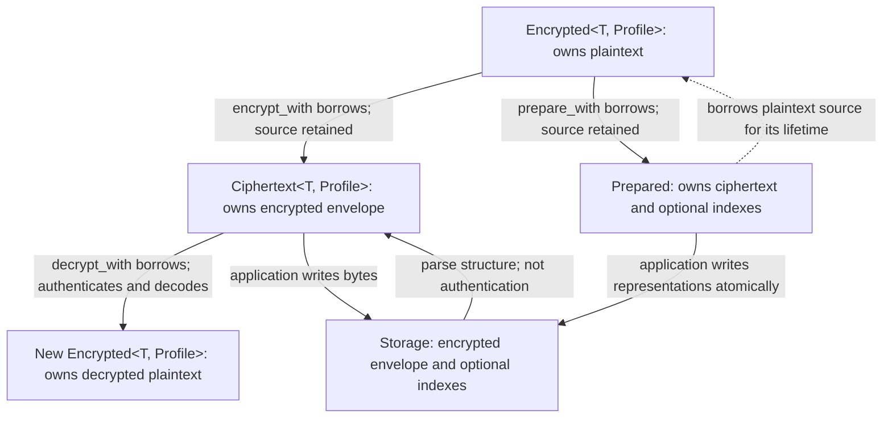

# From application values to stored bytes

**Explanation · current development model.** Use the [canonical glossary](../CONTEXT.md)
for definitions and the [task index](README.md) for procedures.

## Components

- **Profiles** select codecs, padding, binding, and key context for application values.
- **The crypto core** operates on bytes, independently of codecs and storage adapters.
- **Providers** resolve local key generations synchronously. Applications fetch and
  refresh secrets outside encryption/decryption calls.
- **Storage adapters** carry encrypted envelopes and index tokens across SQLx or
  Serde boundaries; applications own transactions and database queries.

The [wire format](wire-format.md) defines the byte-level contracts;
the [threat model](security.md) explains the trust boundary.

## The value lifecycle

<!-- BEGIN SHARED: lifecycle -->

<!-- END SHARED: lifecycle -->

`Encrypted<T, Profile>` contains **plaintext** in application memory, despite
its name. `expose_secret()` makes plaintext access deliberate. `Secret<T>` is
also a plaintext wrapper, without an encryption profile. Neither type is a
promise to erase arbitrary application-owned values.

A profile selects the codec (value to bytes), padding (encoded-length policy),
binding (expected cryptographic domain), and key context. `profile!` declares
that policy; `EncryptionProfile` is its expanded trait form. Encoding and
encryption produce `Ciphertext<T, Profile>`, the stored encrypted envelope.
Encrypting borrows the original value; it does not consume or erase it.
Parsing a ciphertext establishes structure, while decryption authenticates it
and returns a new plaintext-bearing value without consuming the ciphertext.

`Prepared` borrows its source `Encrypted` value and holds ciphertext and optional
blind indexes derived from that value. The application must write the ciphertext
and each index atomically. Merely using an automatic SQLx encrypted column does
not maintain a separate index column.

## Plaintext and key ownership

The lifecycle above describes representations, not automatic erasure of all
copies. The application owns the lifetime of decoded values and any copies it makes.

| Object or buffer | Ownership and end of lifetime |
| --- | --- |
| `Encrypted<T, Profile>` | Owns plaintext `T`. Encryption/preparation borrows it and retains it. Drop drops `T`; it does not invoke zeroization for arbitrary application types. |
| Plaintext clones | `Encrypted::clone` clones `T`, and `Secret::clone` clones its inner value. A `String` clone owns another plaintext allocation. Each copy has an independent lifetime; erasing one does not erase the others. |
| Encoded, padded, normalized and decrypted temporary bytes | CryptBox-owned plaintext buffers use zeroizing storage. Custom codecs and normalizers must protect their own intermediate allocations, including error paths and superseded buffers during growth. The trait's return type alone cannot enforce that. |
| `Prepared` | Owns ciphertext and optional indexes while borrowing the plaintext source. Drop releases the borrow but does not erase the source. Persist the derived representations atomically before dropping preparation. |
| Decrypted application `T` | Decoding creates a new owned value without consuming ciphertext. A plain `String` result has ordinary application-owned storage; dropping the temporary decryption bytes does not wipe this result. |
| `Secret<T>` | Owns `T` through `Zeroizing<T>` and invokes `T::zeroize` on drop. It redacts its own debug output but cannot prevent logging through explicit access or erase earlier copies. The quality of custom `T::zeroize` implementations remains the implementor's responsibility. |
| `EncryptionKey` / `BlindIndexKey` | Clones share reference-counted root material rather than copying the root into a new allocation. That allocation is zeroized when the **last** handle drops; provider snapshots and outstanding returned handles can keep it alive. |
| Key inputs and external copies | Encoded secret strings, caller-owned arrays, environment/configuration copies, serializer allocations, logs, swap and crash dumps have their own lifetimes. Dropping a library key cannot erase them. |

The crypto implementation enables HMAC, SHA-256, and Poly1305 zeroization,
immediately erases the HKDF extract output, and retains derived keys and returned
MACs in zeroizing buffers. Dependency- and compiler-generated copies remain part
of the outstanding review boundary.

For a profile whose value is `String`, move a successful decoded value into a
zeroizing wrapper using `let secret = Secret::new(decrypted.into_secret());`.
`into_secret()` consumes `Encrypted` and returns its `T`; despite the name it
does **not** construct a `Secret` or clone the value. The original encryption
source and any prior clones still exist independently.

To keep the profile value wrapped throughout its application lifetime, use
`Encrypted<Secret<String>, Profile>` with a custom `Codec<Secret<String>>`.
The built-in `Utf8` implements `Codec<String>`, not every wrapper type. The
[custom-profile recipe](custom-profile.md) decodes directly into `Secret<String>`;
its `decrypted.into_secret()` therefore already yields a `Secret`. Normalizers
also need an implementation for the exact wrapped input type.

Preallocate before writing sensitive bytes whenever possible. Growing a
`Zeroizing<Vec<u8>>` with ordinary reserve/push operations can release an old
plaintext-bearing allocation without wiping it. When growth is unavoidable,
copy into a new zeroizing allocation, then wipe the old allocation before release.
Zeroizing only the final returned buffer does not fix abandoned intermediates.

These are ownership and hygiene obligations, not a proof that plaintext never
resides elsewhere. Zeroization does not promise erasure of compiler-generated
copies, registers, OS copies, or arbitrary application allocations. Behavioral
tests can verify public outcomes and sanitized failures; they cannot certify
compiler/operating-system memory wiping. See [security boundaries](security.md).

## Binding context is not key context

The currently available bindings are **sealed** (applications cannot add their
own implementations): `Unbound` and `FieldBound<F>`.
Both use the unit context `()`. Thus `encrypt_with(&(), &keys)` can still be
field-bound: `&()` means no *runtime* binding information is needed, while the
profile supplies the stable field ID. `&keys` is the separate key provider.

`FieldBound<F>` authenticates the logical field for ciphertext and separates
blind-index derivation domains. It does not bind the row or tenant and does not
authenticate stored blind-index bytes. Copying a valid ciphertext between two
rows of the same field can still decrypt successfully. Applications cannot
implement a new `Binding`; row and tenant binding are future work in
[#23](https://github.com/sagikazarmark/cryptbox/issues/23) and
[#24](https://github.com/sagikazarmark/cryptbox/issues/24). Generic context-shaped
APIs do not imply those policies are currently available. Padding is also sealed
to the built-in policies; codecs, index normalizers, profiles, and key providers
are extensible. The [custom-profile recipe](custom-profile.md) demonstrates them.

Context-less operations and automatic adapters obtain providers through the
profile's `KeyContext`. `GlobalKeyContext` is installed once per process and
cannot be reset. Explicit-provider methods use the provider passed by the
caller instead, which makes [parallel-independent tests](testing.md) practical.

## Generations and lookup

Each provider selects one current generation for writes and resolves readable
generations by exact ID. Keep each ID paired with the same material across
restarts; never reuse an ID with different material. Provision encryption and
blind-index root keys independently. The providers are synchronous; fetching
and refreshing secrets is the application's responsibility.

Readable generations include the current generation, retained generations, and
generations staged before writer promotion. A new current encryption key does
not rewrite existing ciphertext or revoke old keys. A new current index key
does not rewrite stored indexes either.

`blind_index_probes` supplies a probe for each readable index generation. Query
all probes, decrypt every candidate, and compare plaintext using the same
normalization policy before accepting it. Truncated indexes intentionally allow
false candidates; do not use them as uniqueness constraints. Candidate comparison
does not authenticate index metadata or establish search completeness.

## Persistent schema

Codec compatibility, padding enabled/disabled, binding, stable field/index IDs,
normalization, and index precision are persistent schema decisions. Stored bytes
do not describe all of them. Changing these requires a migration plan; changing
the parameters of an already-padded policy preserves old readability because
unpadding is parameter-independent. Rust type names and diagnostic labels are not
cryptographic identities.

## Assurance

| Check | Establishes | Does not establish |
| --- | --- | --- |
| Parse ciphertext or deserialize stored bytes | Supported structure and lengths | Authenticity or readability |
| Inspect generations / complete sweep verification | Stored values name the intended generations | Authentication, decodability, or index consistency |
| Decrypt with the expected profile | Authentication, padding removal, and decoding for that value | Row identity, freshness, or index consistency |
| Verify a lookup candidate | Its normalized plaintext matches the query | Stored-index authenticity or completeness of query results |
| Recompute a stored index under its recorded generation | Consistency with authenticated plaintext and the expected index policy | Absence of omitted rows or rollback |

A whole-store audit must cover the complete application-owned population, not only
rows returned by blind-index queries. Follow the
[verification procedure](reencryption-sweep.md#verification-and-retirement) before
retiring keys or closing a migration.
