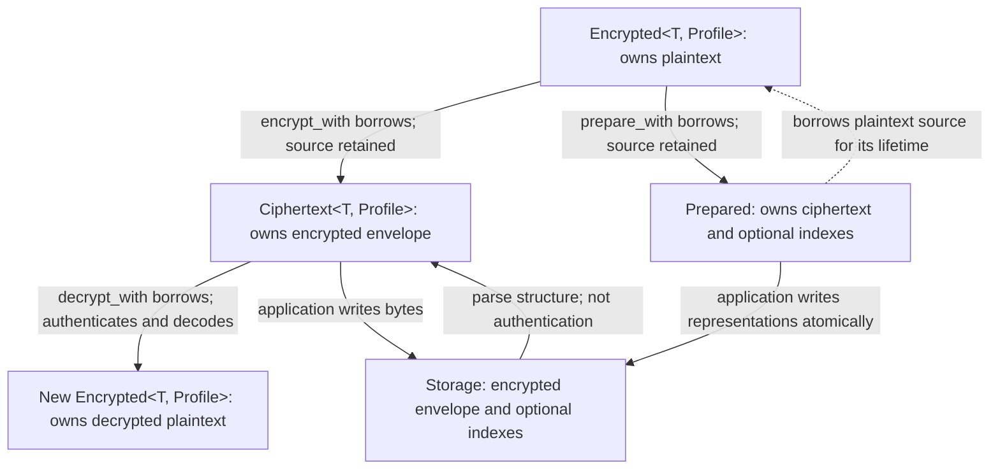

# Encrypt your first field

**Tutorial · published CryptBox 0.5.0 API.** Start with an empty Rust project and
finish an authenticated, field-bound round trip. [All tasks](README.md).
CryptBox is experimental and **not production-ready**; review
[suitability and security](security.md) before adoption.

## 1. Create a consumer project

Install current stable Rust (the library's minimum is Rust 1.85) and Cargo on a
native target with OS entropy, such as Linux or macOS. Dependency downloads
require network access. No database, runtime, optional feature, or library
checkout is needed. See [feature/platform prerequisites](features.md) for other targets.

```sh
cargo new first-field-consumer
cd first-field-consumer
```

Replace `Cargo.toml` with this complete manifest:

<!-- BEGIN SHARED: first-field-manifest -->

```toml
[package]
name = "first-field-consumer"
version = "0.1.0"
edition = "2024"

[dependencies]
cryptbox = "=0.5.0"
```

<!-- END SHARED: first-field-manifest -->

## 2. Encrypt and decrypt

> **Ephemeral demonstration only:** this program generates a new random key and
> generation ID each time it runs. When it exits, the key is lost. Do not persist
> ciphertext using this startup pattern.

Replace `src/main.rs` with the following:

<!-- BEGIN SHARED: first-field -->

```rust
use cryptbox::{Encrypted, EncryptionKey, LocalEncryptionKeyring};

cryptbox::profile! {
    UserEmail: String {
        id: "ca274e85-63c4-4f7d-a255-2dfecbfe5e25",
        name: "user-email",
        codec: cryptbox::Utf8,
        binding: field_bound,
    }
}

fn main() -> Result<(), cryptbox::Error> {
    // Ephemeral demo keys: a new key and generation ID on every run.
    let keys = LocalEncryptionKeyring::new(EncryptionKey::generate()?, [])?;
    let email = Encrypted::<_, UserEmail>::new("mark@example.com".to_owned());
    let ciphertext = email.encrypt_with(&(), &keys)?;
    let decrypted = ciphertext.decrypt_with(&(), &keys)?;
    assert_eq!(decrypted.expose_secret(), "mark@example.com");
    assert_eq!(email.expose_secret(), "mark@example.com"); // Source retained.
    println!("Field-bound round trip succeeded.");
    Ok(())
}
```

<!-- END SHARED: first-field -->

Run it from the consumer directory:

```sh
cargo run
```

After Cargo's build messages, expect `Field-bound round trip succeeded.` and
exit status 0. Both assertions must pass. The program prints no plaintext or key
material. Encryption is randomized, so encrypted bytes differ between runs.

### What just happened?

- `profile!` declared `UserEmail`, selecting `String` with the `Utf8` codec,
  `FieldBound<UserEmail>`, and (by omission) `NoPadding` and `GlobalKeyContext`.
  No padding means the encrypted envelope reveals the encoded plaintext length.
- `Encrypted<String, UserEmail>` **contains plaintext**. Its name expresses the
  policy to apply at a storage boundary, not its current representation.
  `encrypt_with` borrows `email`; the second assertion demonstrates that its
  original plaintext remains available. `decrypted` is another plaintext-bearing
  value. `expose_secret()` makes access explicit; it is not decryption.
- `Ciphertext<String, UserEmail>` holds the encrypted envelope, including the
  generation ID and nonce needed for reading. It holds neither the root key nor
  an owned copy of the original plaintext. Parsing stored bytes checks structure;
  `decrypt_with` authenticates, removes padding, and decodes them.
- `&()` is the **unit binding context**: no runtime binding data is needed because
  the profile supplies the stable field ID. It does not select `Unbound`.
  `&keys` supplies the provider separately. Although the profile defaults to
  `GlobalKeyContext`, these explicit-provider calls never consult it; no global
  provider installation is required.
- Field binding rejects ciphertext substituted from a different logical field.
  It does not bind a row or tenant, prevent same-field substitution, or stop replay.

## 3. Follow ownership to storage

<!-- BEGIN SHARED: lifecycle -->



<!-- END SHARED: lifecycle -->

Both encryption and preparation borrow the source, retaining its plaintext.
Decryption borrows ciphertext and returns a new plaintext-bearing `Encrypted`.
`Prepared` holds ciphertext and optional indexes while borrowing the source;
it does not own or erase that source, and it does not write a database. Copy the
stored representations into an application-owned atomic write, then drop the
short-lived preparation. If indexes are present, write them and the ciphertext
together. See [the lifecycle explanation](concepts.md#the-value-lifecycle).

## 4. Freeze schema decisions before durable storage

The [persistent-schema reference](https://docs.rs/cryptbox/0.5.0/cryptbox/#persistent-schema)
is authoritative. Decide these policies before persisting values:

| Choice | Why it must remain compatible |
| --- | --- |
| Stable field ID | Authenticated binding uses the ID, not the Rust type name or database column name. Keep it through refactors; give different logical fields different IDs. |
| Codec | Readers must decode the same representation that writers encoded. |
| Binding | Switching between field-bound and unbound, or changing a bound field ID, changes authentication. |
| Padding | Enabling/disabling padding requires migration. Parameters of an already-padded policy may change because removal is parameter-independent. |
| Stable index IDs | Each logical blind index has a persistent identity; do not regenerate it at startup. |
| Index normalization and precision | Equality rules and retained bits define stored lookup projections; changing them requires migration and compatible lookup. |

Stored bytes do not describe all these choices. A routine rename must not silently
change schema. This tutorial has no index: when adding one, choose normalization
for your application's equality rules rather than assuming all email addresses
should be lowercased. Index hits are candidates: decrypt and compare normalized
plaintext, and never use truncated indexes as uniqueness constraints.

### Next: keep keys across restarts

For durable ciphertext, provision a random encryption root once in an
application-owned secure secret source and retain its **generation ID together
with the same key bytes**. Load that pair on every startup; never reuse an ID
with different material or silently generate replacement keys if loading fails.
Keep historical generations available while data or recoverable backups need
them. Provision blind-index roots independently from encryption roots.

The current [durable-key and generation guidance](concepts.md#generations-and-lookup)
and [`EncryptionKey::new` contract](https://docs.rs/cryptbox/0.5.0/cryptbox/struct.EncryptionKey.html#method.new)
explain the stable pairing; [key rotation](../examples/key_rotation.rs) demonstrates
current and retained generations. Full secret-loading and restart recipes are
tracked in [#19](https://github.com/sagikazarmark/cryptbox/issues/19).

You can now continue with the [field-bound SQLite exercise](first-field-sqlite.md).
For explicit Serde storage, use the [stored-value tutorial](stored-values.md),
which requires the **unreleased development checkout** rather than published 0.5.0.

## Further reading

<details>
<summary>Expand the profile into traits</summary>

The macro above is equivalent to these implementations. The same field ID and
associated types preserve the policy; expansion is unnecessary for this tutorial.

```rust
struct UserEmail;

impl cryptbox::Field for UserEmail {
    const ID: cryptbox::FieldId =
        cryptbox::field_id!("ca274e85-63c4-4f7d-a255-2dfecbfe5e25");
    const NAME: &'static str = "user-email";
}

impl cryptbox::EncryptionProfile<String> for UserEmail {
    type Codec = cryptbox::Utf8;
    type Binding = cryptbox::FieldBound<Self>;
    type Padding = cryptbox::NoPadding;
    type Keys = cryptbox::GlobalKeyContext;
}
```

</details>

Use [testing and diagnostics](testing.md) when adding application tests or
automatic adapters. Local explicit providers keep tests independent; advanced
global-provider isolation is a separate concern from first success.
