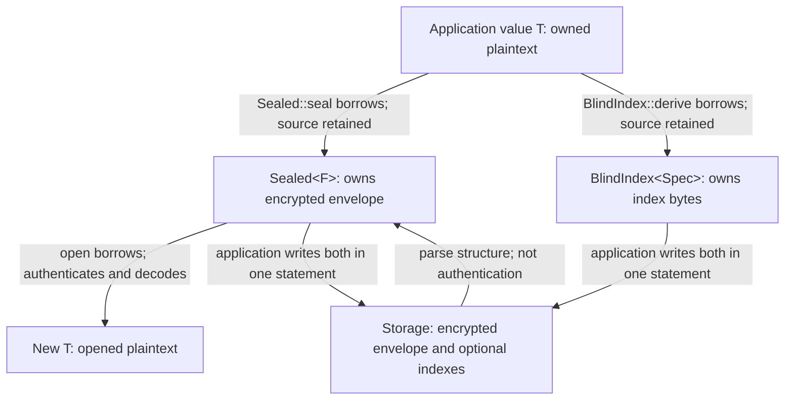

# Guide

CryptBox encrypts selected values inside your Rust application before they reach
storage. The application supplies the keys and decides which values to protect.
Its stored format is stable as of 0.6, its API may still change before 1.0, and
it has not been independently audited: read the [threat model](security.md)
first.

## Records and tenants

Most sensitive values live in rows. Derive `Record` on the row's struct and give
every field one role: the `record_id`, a `seal` with its own seal ID, or
`plaintext`. A field without a role fails the build.

```rust
#[derive(cryptbox::Record)]
pub struct Customer {
    #[cryptbox(record_id)]
    pub id: Uuid,
    #[cryptbox(plaintext)]
    pub org: OrgId,
    #[cryptbox(seal = "2cef6a47-3e20-42dc-a319-56022cb4cf30")]
    #[cryptbox(blind_index(
        id = "ab78afa9-7aaa-499c-8239-037b7e136130",
        bits = 32,
        normalize = normalize_email,
        normalizer = "email/1",
    ))]
    pub email: String,
    #[cryptbox(seal = "5d1f0c3a-8f6e-4b1d-9a7c-2e4b6d8f0a13")]
    pub note: Option<String>,
}
```

The derive generates:

| Item | Name | What it is |
| --- | --- | --- |
| Stored form | `StoredCustomer` (`Stored` + the record's name; rename it with `stored(name = …)`) | The row to write: plaintext fields as they are, each sealed field as `Sealed<_, InRecord<Uuid>>`, and a `BlindIndex` column per index. |
| Index column | `email_index` (the field's name + `_index`) | A field of the stored form. |
| Index handle | `Customer::EMAIL_INDEX` (the column's name, upper case) | `probes` derives a lookup's probes; `open_matching` opens the candidate rows and keeps the matches. |
| Seal | `CustomerEmail` (the record's name + the field's name; rename it with `name = …`) | One per sealed field. |
| Blind-index spec | `CustomerEmailIndex` (the record's name + the column's name) | One per blind index. |

`customer.seal(&keys)` seals the row and `Customer::open(stored, &keys)` opens
it. To open one field: `stored.email.open_in(&stored.id, &keys)`. A record with
blind indexes takes `Keys` with a blind-index keyring; without one, sealing
fails at runtime with `BlindIndexKeysNotConfigured`.

Every sealed field is bound to its seal and to the record ID, so a value copied
to another field or row fails to open. A value sealed on its own with
`Sealed::seal`, a **standalone value**, is bound to its seal ID alone: copied to
another row that stores the same seal, it still opens. Make values fields of a
record when a value copied between rows must fail to open, and give each tenant
its own keyring when tenants must not read each other's values.

A `Secret<String>` or `Secret<Vec<u8>>` field stores the same bytes as the bare
type, but redacts `Debug` and wipes the value on drop. Read it with
`expose_secret()`. A derived `Debug` on the record itself prints every bare
field, so keep sensitive fields in `Secret` or write `Debug` by hand. `Secret`
stores only those two types: a sealed field of any other type, such as a
`u32` or an address with `codec = cryptbox::Json`, needs a hand-written `Debug`
to stay out of logs.

### Plaintext columns are authorized, not authenticated

Opening authenticates the record ID it reads from the row. Other columns, such
as `org`, are plaintext: authorize on them like any other column, after opening
or before anything is decrypted:

```rust
let customer = Customer::open_expecting(stored, &keys, |row| row.org == org)?;
```

A rejected row reports `Error::UnexpectedRecord`. With a keyring per org, a row
of another org, or one whose org column was edited, fails with
`UnknownEncryptionKey`; under one shared keyring an edited org column goes
unnoticed. Storage can also return a whole authentic row in place of another,
and no context prevents replay of an older value of the same record: when you
asked for one record, check its ID.

### Record IDs

The record ID must exist before the first value is sealed. Generate it on the
client (UUIDv7 recommended); sealing against a database-assigned key is not
supported. It need not be the primary key, but must never change while sealed
values exist. It is never encrypted. Its kind is fixed by its type: `[u8; 16]`
or `uuid::Uuid`, `i64`, or `Vec<u8>`; store an ID newtype's inner value.

### Rotating a record's keys

There is no record-level reseal. Each sealed field reports whether it needs one
without opening it: `stored.email.needs_reseal(&keys)?`. To rewrite a row, open
it and seal it again, then write every sealed field and index column in one
statement:

```rust
let customer = Customer::open(stored, &keys)?;
let resealed = customer.seal(&keys)?;
// UPDATE customer SET email = ?, email_index = ?, note = ? WHERE id = ?
```

`needs_reseal` checks the encryption key only. After rotating the blind-index
key, a row whose sealed fields are current can still hold indexes under the old
one: compare
`envelope::inspect_blind_index(stored.email_index.as_bytes())?.index_key_id()`
with the current index key, and rewrite those rows too. Dropping the old index
key first silently drops their rows from lookups.

[Key rotation](operations.md#key-rotation) covers when to promote the new key,
and [maintenance sweeps](operations.md#maintenance-sweeps) how to rewrite rows
in batches.

### Moving a record between orgs

The context does not name the org. With a keyring per org, open the record and
seal it again with the new org's keys (`Sealed::reseal_across` for a standalone
value). Derive every blind index again when orgs have separate index keys, and
write sealed fields and indexes in one atomic write. The moved value leaves the
old org's custody and survives its [shredding](operations.md#shredding); treat
the move as an export where residency rules apply. Reads never reseal.

### Changing a field's seal or record ID

Both are persistent schema. Changing either, or moving a standalone value into a
record, makes existing values fail to open: `AuthenticationFailed` under another
seal ID, `ContextMismatch` under another kind of context. CryptBox has no
migration window for this; plan one, such as reading with the old declaration
while a job reseals. `Sealed::seal` also accepts a record field's seal, and the
resulting standalone value fails to open as the record's with `ContextMismatch`.

The [records example](../examples/records/README.md) runs SQLx and serde
messages; the [tenant example](../examples/tenant_seal.rs) runs a keyring per
tenant (`cargo run --locked --example tenant_seal`).

## How it works

```text
Application value → encode → optionally pad → encrypt → envelope
Application value ← decode ← remove padding ← authenticate and decrypt
```

A **seal** declares how a value is sealed, so call sites do not repeat it. A
record's derive declares one per sealed field; declare one yourself with
`#[derive(Seal)]` for a standalone value:

- a **seal ID**, the stable identity every sealed value and blind index is bound to;
- the **value type**, such as `String`, that `Sealed<F>` opens to;
- a **codec**, such as `Utf8`, between the value and bytes;
- a **padding policy**, which groups plaintext lengths into fewer stored sizes.
  `Padding::NONE` reveals the encoded length.

A seal declares no blind indexes: a `BlindIndexSpec` is declared over a seal,
or a record's field declares one with `blind_index(…)`.

`Sealed::seal` borrows the value and returns a `Sealed<F>`: the **envelope**
(public metadata, encrypted bytes, and an authentication tag) you store. `open`
authenticates it and returns a new value. Parsing stored bytes checks structure
only; opening authenticates.



### Seals

A seal takes one of two forms, which store the same bytes for the same ID and
codec, so a seal can change form without a migration:

- A **marker** is a unit struct over a separate value type: one `Address` type
  can back both `HomeAddress` and `BillingAddress`, each with its own seal ID.
  Prefer it for values that arrive as plain types. A record's derived seals are
  markers.
- A **self-valued seal** is its own value, such as `struct UserEmail(String)` or
  a whole response. It cannot be passed where another seal's value is expected;
  prefer it for whole payloads and existing newtypes.

Markers that declare the same seal ID are one seal, which is usually a copied ID.

### Contexts

Every value is sealed under a **context**: its seal ID, and, for a record's
field, the record's ID too (`Sealed<F, InRecord<Id>>`; a standalone value is
`Sealed<F>`). A value opens only under the same context, even when seals share a
root key. `seal_in` and `open_in` take the context's value, such as the record
ID; a record's `seal` and `open` pass it for you.

### Suites

The seal describes policy; the **suite** defines the cryptography. Suite 1 is
HKDF-SHA-256 with XChaCha20-Poly1305; see the [wire format](wire-format.md).

## Keys

A **keyring** holds key generations: one **current generation** for new writes,
and **readable generations** resolved by the exact key ID stored in each
envelope, never falling back to the current key. A generation is an immutable
pair of a public ID and root material, which is never stored in the envelope.
Changing the current generation changes future writes only; existing ciphertext
still needs its own generation. See [key rotation](operations.md#key-rotation).

`EncryptionKeyring` protects values and `BlindIndexKeyring` blind indexes;
`Keys` pairs an encryption keyring with an optional blind-index keyring.
Every operation takes its keys:
`Sealed::seal` and `open` take an `EncryptionKeyring` or `Keys`;
`BlindIndex::derive` and `probes` a `BlindIndexKeyring` or `Keys`; a record's
`seal` an `EncryptionKeyring`, or `Keys` when it has blind indexes.

For durable data, reload the exact ID/material pair after restarts and retain
readable generations while stored data needs them. A newly generated key cannot
replace a missing one. Generate encryption and blind-index roots independently.
Resolving keys is synchronous: load secrets from your own source and build
keyrings locally. CryptBox does not distribute secrets or refresh remote state,
and changing a startup snapshot's source does not refresh a running process.

### Loading keys

`EncryptionKey::generate` and `BlindIndexKey::generate` never reveal their
material, so they serve tests and demos only. Provision every durable generation
once, outside the application, as a fresh key ID and 32 random bytes kept
together in your secret store:

```sh
uuidgen               # the key ID: public, but unique to this material
openssl rand -hex 32  # the root material: secret
```

Run both again for every generation and for each role: an encryption root and a
blind-index root never share material or an ID. Never reuse a key ID with
different material, and never generate a replacement for a missing generation:
fail to start instead.

At startup, pair each ID with its material and build the keyrings. Key IDs are
not secret, so they can be compiled in with `key_id!` and `index_key_id!`, or
loaded with the material and parsed (`KeyId` and `IndexKeyId` implement
`FromStr`, accepting a hyphenated UUID). `from_hex` takes exactly 64 hex digits
and `from_base64` standard Base64 of 32 bytes; both decode straight into
zeroizing key storage and fail with `Error::InvalidKeyEncoding` without echoing
the input. Erase your copy of the encoded secret yourself, such as by reading it
into a `Zeroizing<String>`.

```rust
use cryptbox::{
    BlindIndexKey, BlindIndexKeyring, EncryptionKey, EncryptionKeyring, IndexKeyId, KeyId, Keys,
    index_key_id, key_id,
};

const ENCRYPTION_1: KeyId = key_id!("6f1c2e9a-0b4d-4c7e-9a35-2d8b7e10c4f2");
const ENCRYPTION_2: KeyId = key_id!("b83e5d27-91a0-4f6c-8d42-7c19e6a03b5d");
const INDEX_1: IndexKeyId = index_key_id!("3a9d0f64-5e21-47b8-b6c3-e0f41d8a2967");

fn load_keys() -> Result<Keys, Box<dyn std::error::Error>> {
    // `secret` is your own loader, returning a `Zeroizing<String>`.
    let encryption = EncryptionKeyring::new(
        // The current generation writes...
        EncryptionKey::from_hex(ENCRYPTION_2, &secret("encryption-2")?)?,
        // ...and previous generations stay readable while stored data needs them.
        [EncryptionKey::from_hex(ENCRYPTION_1, &secret("encryption-1")?)?],
    )?;
    let indexes = BlindIndexKeyring::new(
        BlindIndexKey::from_hex(INDEX_1, &secret("index-1")?)?,
        [],
    )?;
    Ok(Keys::new(encryption).with_blind_indexes(indexes))
}
```

`EncryptionKeyring::new` rejects a key ID repeated within the keyring with
`Error::DuplicateEncryptionKey` (`DuplicateBlindIndexKey` for blind-index
keys). The [SQLite example](../examples/sqlite/README.md) loads a root from a
file; the [searchable example](../examples/searchable/README.md) loads two
generations per role and stages a rotation.

## Choosing keyrings

The seal context is checked by the library. Which keyring protects which values
is application code and is never checked when values are written. Sealing
succeeds under any keyring, so these mistakes are silent:

- **Wrong tenant.** Tenant A's value sealed under B's keyring surfaces only when
  A reads it, possibly much later, and A cannot read it.
- **Wrong custody.** An IBAN sealed under the general keyring instead of the
  payments one stays readable; only a review finds it.
- **Shredding.** A value under the wrong tenant's keyring survives its own
  tenant's shredding, or is destroyed with another's.
- **Audit.** The library cannot report which keys protect which seal.

Resolve keys in one function of your own, which takes what the value belongs to
and returns its keyring or an error, and test it.

### Key-ID rules

Opening with the wrong keyring fails loudly with `Error::UnknownEncryptionKey`
only if key IDs follow these rules:

- Generate every ID as a random UUID, as `EncryptionKey::generate` does.
- Never reuse an ID for different material: the wrong key then looks right, and
  opening fails as corruption.
- Keep IDs unique within a keyring (`Error::DuplicateEncryptionKey`) and never
  share one across keyrings.
- Keep the ID and its bytes together for the life of the data.
- Never let one root serve both encryption and blind indexes.

### Resolving and refreshing

Key resolution must not do I/O on the sealing path: serve a local snapshot.
Cloning a keyring shares its keys rather than copying material, so hand one out
from behind a lock or a swapped snapshot; calls already in flight keep the
keyring they were handed. Cache keyrings per tenant. Fail closed, with your own
error, when the snapshot is not loaded or the tenant is unknown; never fall back
to another tenant's keys. A refreshed keyring keeps every previous key whose
values have not been resealed. The
[custom-seal example](../examples/custom_seal/README.md#implementor-obligations)
states the contract for keys the application refreshes.

Write the custody decision down: a committed table of one row per seal (keys
per what, which hierarchy, shreddable per what), derived from the constant your
resolution reads. Treat a diff to it as a review gate. A seal under one
process-wide keyring is not shreddable on its own; say so.

### Test the choice

- `testing::assert_sealed_under::<CustomerIban>(&sealed, &payments)` panics
  unless the keyring holds the generation the envelope names. The key ID is
  unauthenticated metadata, which suffices for a value the test just sealed.
- Assert that another tenant's keyring returns `Err(Error::UnknownEncryptionKey(_))`.
- Assert that your resolution rejects an unknown tenant.

A round trip with the same keys proves nothing about custody: it passes even
when every seal shares one keyring. Treat a tenant whose custody is untested as
not shreddable.

## Persistent schema

Stored bytes do not describe how they were sealed. An envelope names its format,
suite, key generation, whether it is padded, and a context fingerprint that only
names a mismatch. The application supplies the rest, and these choices are
persistent schema like column types:

| Choice | If it changes |
| --- | --- |
| Value type and codec | Existing bytes may decode into a wrong value without an error. |
| Seal ID | Existing values fail authentication. |
| Record ID type | Existing fields report `ContextMismatch`. |
| Index ID and normalization | Existing indexes silently stop matching. |
| Index precision | Stored indexes and probes no longer agree. |

Rust type names are not identities: renaming a type changes nothing, generating
a new ID changes everything. Generate seal and index IDs with `uuidgen`, one per
seal and index, never derived from a type name or copied from documentation.

Only `String` and `Secret<String>` (`Utf8`) and `Vec<u8>` and `Secret<Vec<u8>>`
(`Raw`) have default codecs; these mappings are permanent. Every other value
type names its codec. Serde codecs make the type's Serde representation schema:
a `rename_all`, `rename` or `tag` change alters every seal using that type.
`Json` stores names, so a renamed field fails or takes its default. A custom
codec over a positional format can decode into wrong values silently when
fields or variants are reordered: append fields, never reorder them.

Name a normalizer's rules with `BlindIndexSpec::NORMALIZER`, such as
`"email/1"`, and bump the version with every change.

Padding is not schema. The envelope authenticates whether its payload is
padded, so enabling, disabling or resizing padding keeps existing values
readable. A [maintenance sweep](operations.md#maintenance-sweeps) rewrites values
when padding is enabled or disabled, but not when it is only resized. See the
[padding contracts](wire-format.md#plaintext-padding).

### Guarding the schema in CI

- **Golden bytes.** `testing::assert_encoding::<F>(&value, "…hex…")` checks that
  a seal still encodes a representative value to committed bytes and back.
  Commit one per seal; it is essential for `Json` seals and custom codecs.
- **Schema manifest.** `schema::Manifest` lists each seal (ID, codec ID,
  padding, and the context fingerprint of each context `sealed::<F, C>()`
  registers), index (ID, seal, bits, normalizer), and record (seals, record ID
  field and kind, context fingerprint, and plaintext fields by name). Snapshot
  its `Display` output, and assert `duplicates()` is empty: it reports a seal
  registered in several kinds of context and a seal ID declared by several
  record fields. The output names IDs, not Rust types, so it is stable across
  toolchains and renames.
- **Unique IDs.** `assert_unique_ids!(HomeAddress, BillingAddress)` and
  `assert_unique_ids!(indexes: EmailLookup, EmailDomain)` fail compilation on a
  shared ID. `#[derive(Record)]` rejects an ID repeated within one record.

The [custom-seal example](../examples/custom_seal/main.rs)'s
`stored_bytes_and_schema_match_their_committed_fixtures` test runs these checks.

## Storage and search

Sealing and opening are explicit calls, so key failures happen at that step;
only sealed bytes cross the storage or serialization boundary. Decoding a
stored form or `Sealed<F>` checks structure without keys, and the application
opens when it needs plaintext.

The application owns schemas, transactions, queries, and concurrency. A record's
stored form is an ordinary struct; forward attributes with `#[cryptbox(stored(…))]`:

- **SQLx:** enable the `sqlx-sqlite` or `sqlx-postgres` feature, which
  implements SQLx's traits for sealed values and indexes, and forward
  `stored(derive(sqlx::FromRow))`; sealed values and indexes are `BLOB` or
  `bytea`; an ID newtype uses `#[sqlx(transparent)]`. Your `sqlx` dependency
  needs [its `derive` feature](features.md), and `uuid` for a `Uuid` record ID.
- **Diesel:** `stored(derive(Queryable, Selectable, Insertable), diesel(table_name = …))`,
  and `stored(diesel(serialize_as = Vec<u8>, deserialize_as = Vec<u8>))` on each
  sealed field and index column.
- **Serde:** `stored(derive(Serialize, Deserialize))`. Human-readable formats
  write unpadded base64url; binary formats write bytes.

### Blind indexes

Encryption uses a fresh nonce, so equal values produce different ciphertext. A
**blind index** is a deterministic, separately keyed, truncated projection of a
normalized value, declared over exactly one seal. Normalization defines equality
(such as lowercasing) and must give the same bytes for a stored value and a
query. A query derives one **probe** per readable index generation; selected rows
are **candidates**, to be authenticated, decrypted, and compared under the same
normalization:

```rust
let probes = Customer::EMAIL_INDEX.probes("ada@example.com", &keys)?;
let rows = select_by_email_index(org, &probes)?; // WHERE org = ? AND email_index IN (…)
for hit in Customer::EMAIL_INDEX.open_matching("ada@example.com", rows, &keys)? {
    let customer = hit?;
    authz.require(user, customer.org)?;
}
```

`open_matching` drops false candidates and reports a row that fails to open as
its error, never as a non-match.

- Blind indexes reveal equality and frequency. Fewer bits mean more false
  candidates, not the absence of that leakage; skewed or low-cardinality values
  stay revealing. They cannot enforce uniqueness.
- The record does not participate, because a query cannot know it: under one
  shared blind-index keyring, equal emails in two orgs share index bytes. Give
  each org its own blind-index keyring when that must not be visible, and select
  candidates only within what the caller may read.
- Keep every readable index generation: a row whose generation is missing still
  decrypts but is absent from lookups. See
  [what each check establishes](security.md#what-each-check-establishes).

A record's `seal` derives its index columns with its sealed fields. For a
standalone value, seal it and derive its indexes from the same value, then write
them in one statement or one transaction, so a stored index never disagrees with
its ciphertext:

```rust
let sealed = Sealed::<UserEmail>::seal(&email, &keys)?;
let index = BlindIndex::<EmailLookup>::derive(&email, &keys)?;
// INSERT INTO users (id, email, email_lookup) VALUES (?, ?, ?)
```

Runnable: [SQLite](../examples/sqlite/README.md),
[searchable storage](../examples/searchable/README.md),
[stored values](../examples/stored_values/README.md).

## Ownership and erasure

The application owns the lifetime of its values and every copy it makes.

| Object | Ownership and erasure |
| --- | --- |
| Application value `T` | Borrowed by `seal` and `BlindIndex::derive`, which retain it. Dropping it does not zeroize arbitrary types. |
| Clones | Each copy of `T` or `Secret<T>` has an independent lifetime; erasing one erases no other. |
| CryptBox temporary buffers | Encoded, padded, normalized and decrypted bytes use zeroizing storage. |
| `Sealed<F>` | Owns the envelope. `open` borrows it and returns a new `T`. |
| Opened `T` | A new, ordinary allocation. Wrap it: `Secret::new(sealed.open(&keys)?)`. |
| `Secret<T>` | Zeroizes `T` on drop and redacts `Debug`; it cannot prevent explicit access or erase earlier copies. |
| `EncryptionKey`, `BlindIndexKey` | Clones share reference-counted material, zeroized when the last handle drops. |
| Key inputs and external copies | Secret strings, caller arrays, environment, logs, swap and crash dumps are out of reach. |

A seal can store `Secret<String>` or `Secret<Vec<u8>>` directly with the same
bytes as the bare types. Custom codecs and normalizers must protect their own
intermediate allocations, including error paths and allocations released by
growth: `Zeroizing<Vec<u8>>` wipes only its current allocation. Zeroization does
not reach compiler or OS copies. See the
[implementor obligations](../examples/custom_seal/README.md#implementor-obligations).

## Testing

Give each test its own keyrings. Nothing reads a global, so tests run in
parallel ([example](../tests/testing_local.rs)).
Predictable roots and reused IDs are test fixtures only.

### Diagnostics

CryptBox does not log. Log only the stable `Seal::ID`, a static label without
record data, the operation, and a sanitized error category. Never log plaintext,
normalized or encoded values, keys, ciphertext or index dumps, query parameters,
or arbitrary upstream error chains; redacted `Debug` does not sanitize the data
around it. Sanitize configuration errors where they are read:
`VarError::NotUnicode` can retain database credentials. The
[diagnostics example](../tests/fixtures/app/src/bin/testing-diagnostics.rs)
damages a tag and logs only `error=authentication_failed` with the seal's IDs.
