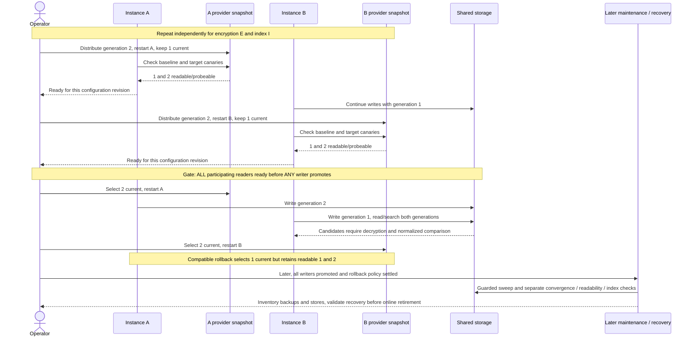

# Key lifecycle

**How-to · CryptBox 0.5.0.** Stage readers, promote writers, then retire online
access while preserving recovery. [All tasks](README.md) · [Maintenance sweeps](reencryption-sweep.md).

## Key states and the promotion gate

A generation is an immutable **ID/root-material pair**. Generate encryption and
blind-index roots independently; never replace material under an existing ID.
The current generation writes new ciphertext or indexes. Readable encryption
generations decrypt by exact ID; every readable index generation supplies a
lookup probe. Readable generations may be staged before their first write.

Before **any writer** promotes a role, **every participating reader** must load
the same new pair while retaining existing pairs and prove compatibility. Include
workers, scheduled jobs, read-only services, autoscaling and rollback deployments.
Preserve the profile/index schema, query all readable probes, and authenticate,
decrypt and normalize-compare candidates. A secret on disk is not readiness.

Record acknowledgments against a configuration revision and trusted canary set
from each serving instance. Missing, failed or outdated instances block promotion.
The deployment owns this gate and controls who can change write selection.

The [consumer](snippets/searchable.rs) has independent `CRYPTBOX_ENCRYPTION` and
`CRYPTBOX_INDEX` selectors; set both and unset `CRYPTBOX_GENERATION` for explicit
rollouts. For each role, `1` loads only generation 1; `staged` writes 1 and reads
1/2; `2` writes 2 and reads 1/2; `2-only` loads only 2 after retirement gates.
For the next rotation, `staged-3` writes 2 and reads 1/2/3; `3` writes 3 and reads
1/2/3. Provision new independent files once, preserving existing pairs.
The introductory shorthand `CRYPTBOX_GENERATION=1` means both roles **staged**,
not generation-1-only; `=2` promotes both. An explicit pair takes precedence;
partial pairs and invalid selections fail startup.

### What the readiness command proves

Generate `rotation-canary FILE` once from the trusted target configuration and
distribute that same synthetic envelope/index fixture to all readers. It uses
the selected current pair without connecting to storage. Retain baseline canaries
too. Independently regenerating fixtures on readers would miss mismatched material
under the same IDs; writing future-generation rows into live storage would expose
incompatible readers before the gate passes.

`rotation-ready FILE` authenticates/decrypts, compares the known plaintext, and
checks the complete token against all local probes. Failure blocks promotion.
Run readiness with the snapshot actually serving traffic, including after restart.
This establishes material compatibility, not fleet membership or a whole-store audit.

## Stage encryption everywhere, then promote its writers

1. Prepare a target-encryption/baseline-index canary and retain the baseline one.
2. Distribute the new encryption pair to all readers, keeping the old pair current.
   Restart or refresh providers and collect readiness for both canaries.
3. Once every reader is ready, promote encryption writers incrementally. During
   overlap, both old and new ciphertext must decrypt and search correctly.
4. Finish promotion on every writer before planning convergence.

Encryption promotion neither rotates index keys nor rewrites stored rows.

## Stage index probes everywhere, then promote index writers

Repeat the gate independently for the new index pair, retaining historical probes.
Use a target-encryption/target-index canary: a reader may decrypt it successfully
yet fail its probe check. Missing index material can silently omit matches.
After all readers acknowledge readiness, promote index writers incrementally.
Normal writes atomically persist prepared ciphertext and indexes; a later
[index-only sweep](reencryption-sweep.md#blind-indexes) need not change ciphertext.

## Restart and roll back compatibly

Recheck baseline and target canaries on restarted instances, plus historical/new
reads and all-probe searches. To roll back **write selection**, retain the union
of generations used before and after promotion. In the consumer this means
`staged`, not `1`. Dropping the newer encryption pair breaks reads; dropping the
newer index pair can hide matches even when decryption succeeds.

A binary rollback must also support the stored formats, persistent schema and
all-probe candidate verification. If it cannot load the compatible keyset, keep
compatible readers serving while repairing the rollout. Settle rollback policy
before sweeping: old-generation writers can reintroduce dependencies behind progress.

### Provider lifecycle

The consumer loads `LocalEncryptionKeyring` and `LocalBlindIndexKeyring` once at
startup. File/environment changes do not replace a running snapshot; drain/restart
the process. For automatic adapters, `GlobalKeyContext::install` is immutable and
one-time per process. Restart, or have the originally installed custom provider
refresh its own synchronized snapshot. That provider owns consistency, refresh
failures and readiness; synchronous CryptBox calls do not distribute secrets or
refresh KMS state. See [provider obligations](custom-profile.md#implementor-obligations).

## Sequence and later maintenance

<!-- BEGIN SHARED: rotation -->



<!-- END SHARED: rotation -->

Rotation changes future writes; rewriting is separate and reads never silently
rewrite storage. Neither rotation nor online removal revokes leaked keys/ciphertext,
erases copies, or guarantees crypto-shredding.

## Retirement and recovery

Treat stopping old writes, removing online access, retaining recovery material and
destroying material as separate decisions. Keep historical encryption pairs and
index probes available throughout rewriting and verification.

### Inventory before retirement

Record owners, locations, both roles' generation dependencies, schema/software
revisions, retention disposition and restore evidence for every live store and
retained artifact. Include tables/tenants, replicas, caches, queues, projections,
backups/PITR logs, snapshots, archives/exports, offline copies, rollback deployments,
secret versions and migration quarantine, including copies held by other teams.

A recovery manifest ties backup identity, capture time and consistency boundary
to stable key IDs and compatible binary/configuration revisions. Retain field/index
IDs, binding, codec, padding, normalization and precision. Keep secret material
under separate controlled custody, not inside the manifest or database backup.
Root bytes alone are insufficient to restore application behavior.

### Remove historical online providers, retain recovery material

1. Prove an isolated restore using the retained historical pairs **before** changing
   online access. Use consistent backup tooling; for SQLite the consumer's
   `recovery-copy NEW_FILE` uses `VACUUM INTO`, includes committed WAL data and
   refuses an existing destination. Do not raw-copy an active database without its WAL.
2. Complete writer promotion and guarded sweeps across the live inventory. Apply
   the full [verification and audit procedure](reencryption-sweep.md#verification-and-retirement),
   including expected row coverage. Prevent stale writers, rollback configurations
   and restores from reintroducing historical dependencies. Hold a write/restore
   pause through final checks and provider cutover, or supply equivalent consistency.
3. Distribute reduced online providers and drain/restart every relevant process.
   Verify current-only reads, audits and searches on the serving configuration.
   The consumer's `2-only` loads only that role's generation-2 file; ordinary `2`
   still loads both. Verify that historical canaries fail in the reduced provider.
4. Retain exact historical pairs separately for recovery. Removing online files
   models custody separation; it is not secure erasure. Schedule restore rehearsals.

### Restore and search in isolation

Restore to a new destination with separate processes, recovery-only keys and
isolated credentials/network routing. Disable serving traffic, schedulers, imports
and outbound effects before startup; preserve the original backup unchanged.
Verify historical canaries, authenticated reads, the full audit, expected captured
row set and historical searches. Trusted backup provenance and the capture boundary
supply the recovery point: authentication does not establish freshness or row binding.

Historical indexes need historical probes independently of encryption keys.
Successful decryption with missing index material can accompany an empty, incomplete
search. For isolated historical reads, retain the old probes; no rewrite is needed.
If re-indexing instead, complete and verify it before using current-only lookup.

### Returning recovered data to service

Keep traffic fenced. Load the union of restored and target generations into every
recovery reader/writer, validate readiness, then select target writes. Sweep under
a **fresh recovery run identity**, never blindly resume restored progress. Repeat
the full audit and expected-result searches, accounting for loss since capture.
Route traffic only after verified cutover with compatible application/rollback
configuration; returning to current-only service requires rewriting historical
dependencies first. Historical-key service requires an explicit fleet-compatible
cutover, never a silent return of old writers.

Pre-migration backups also require retained legacy handlers/keys, schema and
[provenance checks](legacy-migration.md#verification-and-closing-the-window).
Strict live closure does not remove those recovery dependencies.

### Evidence before eventual destruction

The retention owner must establish that every dependent artifact has expired and
been disposed of, migrated with separately validated recovery, or been explicitly
approved to become unrecoverable. Include secret-store backups, escrow/replicas,
rollback copies, historical indexes and legacy material. Test the surviving recovery
set and record any accepted loss of access without logging secrets.

Execute and verify destruction through application-owned secret/storage mechanisms,
including cached snapshots, running processes and retained copies. A clean live
scan, removed file or dropped online keyring proves neither physical erasure nor
destruction of all copies. CryptBox supplies no inventory, escrow or erasure service.

## Runnable scenarios

Use the [consumer setup](searchable-sqlx.md) and [test runner](documentation.md#local-checks).
The [rotation scenario](../tests/e2e/rotation.rs) exercises staggered
role promotion and rollback; the [recovery scenario](../tests/e2e/recovery.rs)
exercises preflight restore, online removal and isolated historical lookup.
From the repository root with Rust/Cargo 1.85+, a native C compiler
for bundled SQLite, and dependency access:

```sh
cargo test --locked --test e2e --all-features sqlite_rotation
cargo test --locked --test e2e --all-features sqlite_recovery
```

For live PostgreSQL rotation, see the [test instructions](documentation.md#live-postgresql).
Recovery uses
SQLite and does not validate PostgreSQL backup tooling. The runner creates fresh
fixtures; never start generation-1-only providers against already-promoted data.
