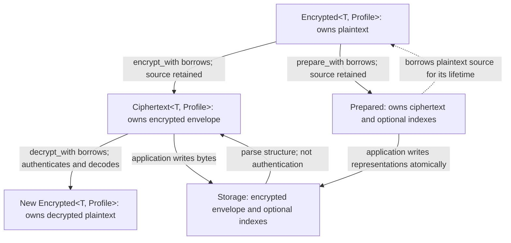

# Plaintext and key ownership

This reference describes borrowing, cloning, and erasure for CryptBox values and
buffers. For the introductory flow, read [how CryptBox works](concepts.md).
The application owns the lifetime of decoded values and any copies it makes.

## Value lifecycle

<!-- BEGIN SHARED: lifecycle -->

<!-- END SHARED: lifecycle -->

## Ownership and end of lifetime

| Object or buffer | Ownership and end of lifetime |
| --- | --- |
| `Encrypted<Profile>` | Owns plaintext `T`. Encryption/preparation borrows it and retains it. Drop drops `T`; it does not invoke zeroization for arbitrary application types. |
| Plaintext clones | `Encrypted::clone` clones `T`, and `Secret::clone` clones its inner value. A `String` clone owns another plaintext allocation. Each copy has an independent lifetime; erasing one does not erase the others. |
| Encoded, padded, normalized and decrypted temporary bytes | CryptBox-owned plaintext buffers use zeroizing storage. Custom codecs and normalizers must protect their own intermediate allocations, including error paths and superseded buffers during growth. The trait's return type alone cannot enforce that. |
| `Prepared` | Owns ciphertext and optional indexes while borrowing the plaintext source. Drop releases the borrow but does not erase the source. Preparation does not persist data. |
| Decrypted application `T` | Decoding creates a new owned value without consuming ciphertext. A plain `String` result has ordinary application-owned storage; dropping the temporary decryption bytes does not wipe this result. |
| `Secret<T>` | Owns `T` through `Zeroizing<T>` and invokes `T::zeroize` on drop. It redacts its own debug output but cannot prevent logging through explicit access or erase earlier copies. The quality of custom `T::zeroize` implementations remains the implementor's responsibility. |
| `EncryptionKey` / `BlindIndexKey` | Clones share reference-counted root material rather than copying the root into a new allocation. That allocation is zeroized when the **last** handle drops; provider snapshots and outstanding returned handles can keep it alive. |
| Key inputs and external copies | Encoded secret strings, caller-owned arrays, environment/configuration copies, serializer allocations, logs, swap and crash dumps have their own lifetimes. Dropping a library key cannot erase them. |

## `into_secret` and wrapped values

`Encrypted::into_secret()` consumes the wrapper and returns its `T`. It does not
construct a `Secret` or clone the value. For a `String` profile, wrapping the result
as `Secret::new(decrypted.into_secret())` gives that returned string a zeroizing
owner; the original encryption source and any prior clones still exist independently.

`Encrypted<Profile>` requires a codec for `Secret<String>`.
The built-in `Utf8` implements `Codec<String>`, not every wrapper type. Normalizers
also require an implementation for the exact input type. The
[custom-profile example](../examples/custom_profile/README.md) demonstrates a codec that decodes
directly into `Secret<String>`.

## Temporary buffers and erasure limits

The crypto implementation enables HMAC, SHA-256, and Poly1305 zeroization,
immediately erases the HKDF extract output, and retains derived keys and returned
MACs in zeroizing buffers. Dependency- and compiler-generated copies remain part
of the outstanding review boundary.

`Zeroizing<Vec<u8>>` wipes its current allocation, not allocations previously
released by growth. Custom implementations must protect intermediate allocations
and failure paths as well as returned buffers. See the
[implementor guidance](../examples/custom_profile/README.md#implementor-obligations) for allocation handling.

Zeroization does not promise erasure of compiler-generated copies, registers,
OS copies, or arbitrary application allocations. Behavioral tests can verify
public outcomes and sanitized failures; they cannot certify compiler/operating-system
memory wiping. See the [security boundaries](security.md).
