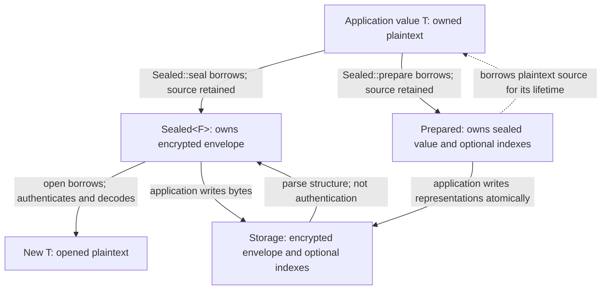

# Plaintext and key ownership

This reference describes borrowing, cloning, and erasure for CryptBox values and
buffers. For the introductory flow, read [how CryptBox works](concepts.md).
The application owns the lifetime of decoded values and any copies it makes.

## Value lifecycle

<!-- BEGIN SHARED: lifecycle -->

<!-- END SHARED: lifecycle -->

## Ownership and end of lifetime

| Object or buffer | Ownership and end of lifetime |
| --- | --- |
| Application value `T` | The field's value type, owned by the application. `Sealed::seal` and `Sealed::prepare` borrow it and retain it. Drop drops `T`; it does not invoke zeroization for arbitrary application types. |
| `Plain<F>` | The automatic column's plaintext carrier: owns a `T`. Encoding the column borrows it. Drop drops `T` without zeroization. |
| Plaintext clones | Cloning `T` or `Plain<F>` clones the value, and `Secret::clone` clones its inner value. A `String` clone owns another plaintext allocation. Each copy has an independent lifetime; erasing one does not erase the others. |
| Encoded, padded, normalized and decrypted temporary bytes | CryptBox-owned plaintext buffers use zeroizing storage. Custom codecs and normalizers must protect their own intermediate allocations, including error paths and superseded buffers during growth. The trait's return type alone cannot enforce that. |
| `Sealed<F>` | Owns the encrypted envelope bytes. Opening borrows it and returns a new `T`. |
| `Prepared` | Owns the sealed value and optional indexes while borrowing the plaintext source. Drop releases the borrow but does not erase the source. Preparation does not persist data. |
| Opened application `T` | `open` decodes a new owned value without consuming the sealed value. A plain `String` result has ordinary application-owned storage; dropping the temporary decryption bytes does not wipe this result. |
| `Secret<T>` | Owns `T` through `Zeroizing<T>` and invokes `T::zeroize` on drop. It redacts its own debug output but cannot prevent logging through explicit access or erase earlier copies. The quality of custom `T::zeroize` implementations remains the implementor's responsibility. |
| `EncryptionKey` / `BlindIndexKey` | Clones share reference-counted root material rather than copying the root into a new allocation. That allocation is zeroized when the **last** handle drops; keyrings and outstanding returned handles can keep it alive. |
| Key inputs and external copies | Encoded secret strings, caller-owned arrays, environment/configuration copies, serializer allocations, logs, swap and crash dumps have their own lifetimes. Dropping a library key cannot erase them. |

## Opened and wrapped values

`open` returns the field's bare value type; `Plain::into_inner()` likewise
consumes the column wrapper and returns its `T`. Neither constructs a `Secret`.
For a `String` field, `Secret::new(sealed.open(args, &keys)?)` gives the opened
string a zeroizing owner; the original sealing source and any prior clones still
exist independently.

A field can also store `Secret<String>` or `Secret<Vec<u8>>` directly. `Utf8`
and `Raw` encode them with exactly the same bytes as `String` and `Vec<u8>`, and
they are the wrappers' `Plaintext` codecs. Other wrapper types need their own
codec. Normalizers also require an implementation for the exact input type. The
[custom-field example](../examples/custom_field/README.md) demonstrates a validating codec that decodes
directly into `Secret<String>`.

## Temporary buffers and erasure limits

The crypto implementation enables HMAC, SHA-256, and Poly1305 zeroization,
immediately erases the HKDF extract output, and retains derived keys and returned
MACs in zeroizing buffers. Dependency- and compiler-generated copies remain part
of the outstanding review boundary.

`Zeroizing<Vec<u8>>` wipes its current allocation, not allocations previously
released by growth. Custom implementations must protect intermediate allocations
and failure paths as well as returned buffers. See the
[implementor guidance](../examples/custom_field/README.md#implementor-obligations) for allocation handling.

Zeroization does not promise erasure of compiler-generated copies, registers,
OS copies, or arbitrary application allocations. Behavioral tests can verify
public outcomes and sanitized failures; they cannot certify compiler/operating-system
memory wiping. See the [security boundaries](security.md).
