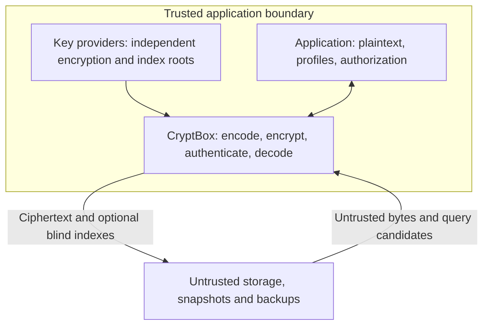

# Threat model and security boundaries

**Explanation · experimental assurance.** CryptBox encrypts selected application
values before storage. **It is not production-ready.** Ciphertext format 1,
blind-index format 1, and suite 1 remain experimental; version numbers and passing
tests do not indicate security approval. [All tasks](README.md).

## Trust boundary and assumptions

<!-- BEGIN SHARED: trust-boundary -->

<!-- END SHARED: trust-boundary -->

Confidentiality assumes keys and plaintext-bearing artifacts remain separate from
compromised storage. Trust the application, providers, dependencies, and operating
system: root keys must be cryptographically random, encryption and index roots
independently generated, and each generation ID permanently paired with the same
material. IDs are public metadata; generate them independently of key bytes.
Profiles supply trusted expected bindings and persistent schema. Secure OS
randomness and a compatible target are required; see [platform constraints](features.md#platforms-and-tested-configurations).

## Threats and unsuitable uses

| Attacker capability | Protection or limitation |
| --- | --- |
| Read dumps, snapshots, backups, or detached volumes | Selected values remain confidential under the assumptions above. Other columns, IDs, and metadata remain visible. |
| Modify stored ciphertext | Authenticated decryption rejects tampering. Parsing alone does not authenticate; malformed formats or unknown keys may fail earlier. |
| Copy ciphertext to another logical field | `FieldBound` rejects a different field at authentication; `Unbound` explicitly opts out. |
| Copy ciphertext between rows of the same field | Substitution can succeed. Row/tenant binding is unavailable. |
| Restore an older authentic value | No replay, rollback, or freshness protection. |
| Observe sizes, indexes, and queries | Unpadded length reveals encoded length; padding reveals a bucket or fixed target. Blind indexes leak equality/frequency; access patterns remain visible. |
| Alter indexes or omit query results | Candidate comparison rejects false matches, but cannot detect omitted matches. Search completeness is not guaranteed. |
| Compromise the live application | Plaintext and keys can be exposed. CryptBox supplies no process-isolation boundary. |

CryptBox is unsuitable for requirements such as production-approved cryptography
today, FIPS-validated AES, transparent whole-database encryption, arbitrary
encrypted queries, or secrecy from the application itself. Blind indexes support
equality-style candidate lookup, not ordering, ranges, or full-text search.

## Application responsibilities

- Own authorization, key provisioning, stable profile/index schema, and operational
  limits. Bound encoded/padded sizes, incoming envelopes, decoding expansion, and
  repeated authentication attempts; the [functional size limit](wire-format.md#size-semantics-and-enforcement)
  is not an operational budget.
- Store ciphertext and indexes atomically. Query every readable index generation,
  authenticate/decrypt candidates, and compare identically normalized plaintext.
  Never use truncated indexes as uniqueness constraints. Avoid indexing
  low-cardinality or highly skewed sensitive values; truncation does not remove
  their leakage. Detecting missing rows requires application-owned evidence.
- Protect logs, traces, crash dumps, swap, configuration, and application copies.
  CryptBox-owned zeroization cannot erase every copy; see
  [plaintext and key ownership](concepts.md#plaintext-and-key-ownership).
- Treat rotation as selection of a new current generation, not revocation,
  re-encryption, or crypto-shredding. Follow [key lifecycle and recovery](key-rotation.md)
  and the [whole-store audit](reencryption-sweep.md#verification-and-retirement).
  Generation convergence alone establishes neither authenticated readability nor
  index consistency, and live-table convergence does not retire backup dependencies.

## Why these constructions

HKDF-SHA-256 separates operational keys by version, suite, generation, and binding.
XChaCha20-Poly1305 uses fresh OS-random 192-bit nonces, avoiding coordinated counters
across processes. It is **not nonce-misuse-resistant**: repeating a complete nonce
under one operational key is unsafe. Its specification is an expired IETF draft,
not a final standard. Separately keyed, domain-separated HMAC-SHA-256 indexes
permit deterministic lookup and independent rotation; truncation trades precision
for false candidates, without eliminating equality leakage.

## Security review path

Read the [wire recipes and provisional vectors](wire-format.md), then the
[current model](concepts.md) and [API reference](https://docs.rs/cryptbox/0.5.0/cryptbox/).
Outstanding gates include independent vectors ([#10](https://github.com/sagikazarmark/cryptbox/issues/10)),
HKDF/HMAC/AAD composition and failure-path review, parser fuzzing
([#11](https://github.com/sagikazarmark/cryptbox/issues/11)), target/entropy and
compiler/zeroization review, accepted usage policy with an enforcement strategy,
and pilot use before format freeze ([#12](https://github.com/sagikazarmark/cryptbox/issues/12)).
A primitive implementation's audit does not audit CryptBox's composition.

## Historical references

The frozen [suite research (2026-08-21)](https://github.com/sagikazarmark/cryptbox/blob/0c3627e1817b88cfdc681efec20335fde525c526/docs/suite-evaluation.md),
[usage proposal (2026-08-21)](https://github.com/sagikazarmark/cryptbox/blob/0c3627e1817b88cfdc681efec20335fde525c526/docs/suite-1-usage-policy.md)
([#15](https://github.com/sagikazarmark/cryptbox/issues/15)), and
[v0.1 design](https://github.com/sagikazarmark/cryptbox/blob/0c3627e1817b88cfdc681efec20335fde525c526/docs/spec.md)
retain rationale and deferred plans. The numeric policy remains **proposed**;
issue closure recorded authoring, not acceptance. Its message-size, count, age,
and deployment failure budgets are not library-enforced.
