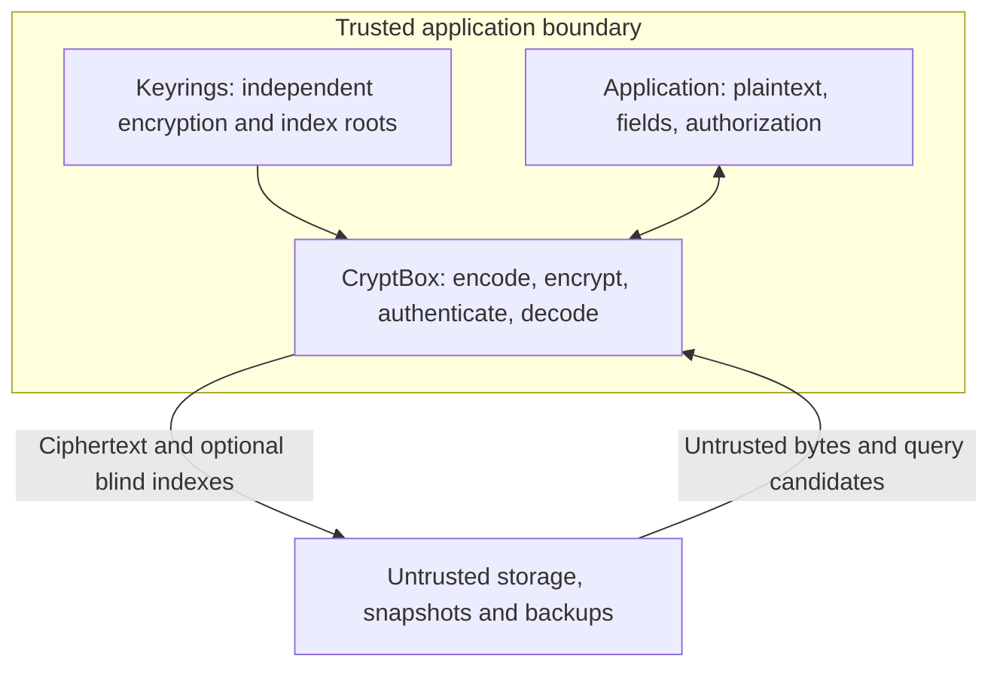

# Threat model and security boundaries

CryptBox encrypts selected application values before storage.
**It is not production-ready.** Ciphertext format 2, blind-index format 2, and
suite 1 remain experimental; version numbers and passing tests do not indicate
security approval.

## Trust boundary and assumptions

```mermaid
flowchart TB
    subgraph trusted["Trusted application boundary"]
        K["Keyrings: independent encryption and index roots"]
        A["Application: plaintext, fields, authorization"]
        C["CryptBox: encode, encrypt, authenticate, decode"]
        K --> C
        A <--> C
    end
    C -->|"Ciphertext and optional blind indexes"| S["Untrusted storage, snapshots and backups"]
    S -->|"Untrusted bytes and query candidates"| C
```

Confidentiality assumes keys and plaintext-bearing artifacts stay separate from
compromised storage. The application, its key resolution, dependencies, and
operating system are trusted. Root keys must be cryptographically random,
encryption and index roots generated independently, and each generation ID
permanently paired with the same material. IDs are public metadata. A `Record`'s
record ID is checked by opening every sealed field; its plaintext columns, such
as a tenant, are not, so authorize on them. Secure OS randomness and a compatible
target are required; see [platform constraints](features.md#platforms-and-tested-configurations).

## Threats and unsuitable uses

| Attacker capability | Protection or limitation |
| --- | --- |
| Read dumps, snapshots, backups, or detached volumes | Selected values remain confidential. Other columns, IDs, and metadata remain visible. |
| Modify stored ciphertext | Authenticated decryption rejects tampering. Parsing alone does not authenticate. |
| Copy ciphertext to another seal | Rejected. A record field's value read as a standalone value reports `ContextMismatch`. |
| Copy ciphertext to another tenant | Only keys separate tenants: with a keyring per tenant, it fails with `UnknownEncryptionKey`. Under a shared keyring, a plaintext tenant column changed in place is not detected. |
| Copy ciphertext between rows of the same seal | Rejected for a record's fields. Standalone values can be substituted among rows under the same keys. |
| Return a whole row in place of another | Every value opens, since each is bound to its own row. When you asked for a record by ID, compare the opened ID with it. |
| Restore an older authentic value | No replay, rollback, or freshness protection. |
| Observe sizes, indexes, and queries | Unpadded length reveals encoded length; padding reveals a bucket. Blind indexes leak equality/frequency across every value of their seal under the same index keys. Access patterns remain visible. |
| Alter indexes or omit query results | Candidate comparison rejects false matches but cannot detect omitted ones. |
| Compromise the live application | Plaintext and keys can be exposed. |

CryptBox is unsuitable for production-approved or FIPS-validated cryptography,
transparent whole-database encryption, arbitrary encrypted queries, or secrecy
from the application itself. Blind indexes support equality lookup, not ordering,
ranges, or full-text search.

## Application responsibilities

- Own authorization, key provisioning, stable schema, and operational limits:
  bound sizes, incoming envelopes, and repeated authentication attempts. The
  [functional size limit](wire-format.md#size-semantics-and-enforcement) is not an
  operational budget.
- Store ciphertext and indexes atomically. Query every readable index generation,
  open candidates, and compare normalized plaintext. Never use truncated indexes
  as uniqueness constraints, and avoid indexing low-cardinality sensitive values.
- Protect logs, traces, crash dumps, swap, and application copies; see
  [ownership and erasure](guide.md#ownership-and-erasure).
- Treat rotation as selecting a new current generation, not revocation or
  re-encryption; see [key rotation](operations.md#key-rotation). Live-table
  convergence does not retire backup dependencies.

## What each check establishes

| Check | Establishes | Does not establish |
| --- | --- | --- |
| Parse ciphertext or deserialize stored bytes | Supported structure and lengths | Authenticity or readability |
| Inspect generations / sweep verification | Stored values name the intended generations | Authentication, decodability, or index consistency |
| Open with the expected seal, or a record | Authentication under that seal (and record), padding removal, decoding | Row identity for a standalone value, freshness, or index consistency |
| Verify a lookup candidate | Its normalized plaintext matches the query | Index authenticity or completeness of results |
| Recompute a stored index under its generation | Consistency with authenticated plaintext | Absence of omitted rows or rollback |

A whole-store audit must cover every row, not only rows returned by index queries;
see [maintenance sweeps](operations.md#maintenance-sweeps).

## Why these constructions

HKDF-SHA-256 separates operational keys by version, suite, generation, and context.
XChaCha20-Poly1305 uses fresh OS-random 192-bit nonces, avoiding coordinated
counters across processes; it is **not nonce-misuse-resistant**, and its
specification is an expired IETF draft. Separately keyed, domain-separated
HMAC-SHA-256 indexes permit deterministic lookup and independent rotation;
truncation trades precision for false candidates without removing equality leakage.

## Review status

Outstanding gates include independent vectors ([#10](https://github.com/sagikazarmark/cryptbox/issues/10)),
HKDF/HMAC/AAD composition and failure-path review, parser fuzzing
([#11](https://github.com/sagikazarmark/cryptbox/issues/11)), target and
zeroization review, an accepted usage policy, and pilot use before format freeze
([#12](https://github.com/sagikazarmark/cryptbox/issues/12)). A primitive
implementation's audit does not audit CryptBox's composition. Earlier research and
the proposed usage policy are frozen at
[0c3627e](https://github.com/sagikazarmark/cryptbox/tree/0c3627e1817b88cfdc681efec20335fde525c526/docs)
([#15](https://github.com/sagikazarmark/cryptbox/issues/15)).
